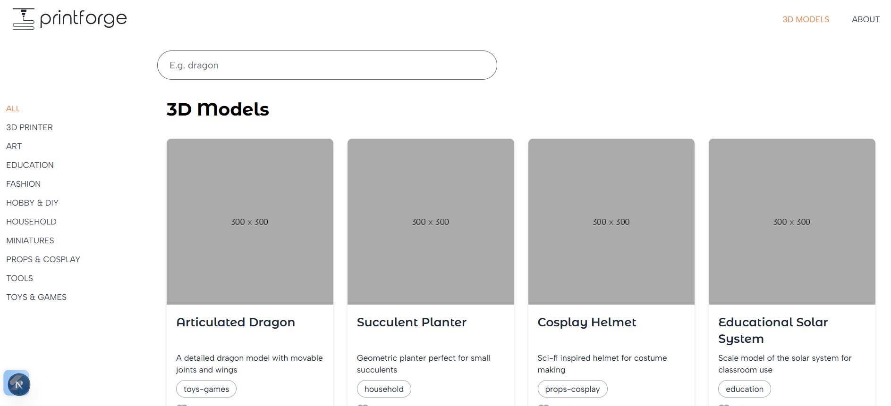
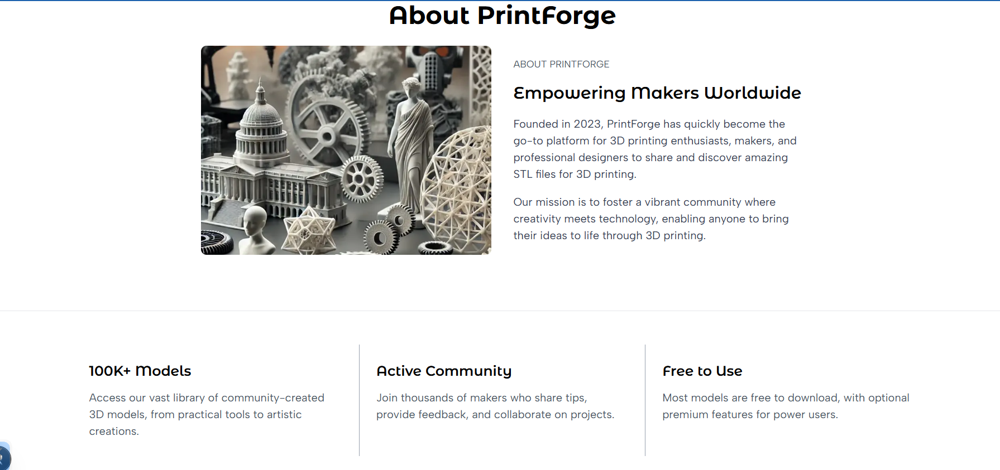

# PrintForge (Next.js + Tailwind)

## What this project does
PrintForge is a small Next.js app that displays a catalog of 3D models. Users can browse:
- **All 3D Models**
- **Categories** under `/3d-models/categories/[categoryName]`
- **Model details** under `/3d-models/[id]`

## Key routes
- `/` – Home page
- `/3d-models` – Models listing + search
- `/3d-models/categories/[categoryName]` – Models filtered by category
- `/3d-models/[id]` – Single model details
- `/about` – About page

## Output

## Active navigation coloring (the “orange link” behavior)
The orange highlight for active links is controlled by the reusable component:

- `app/components/NavLink.tsx`
  - It conditionally applies the Tailwind class `text-orange-accent` only when `isActive` is `true`.

- `app/components/Navbar.tsx`
  - Currently sets `isActive` with strict equality:
    - `pathname === "/3d-models"`
  - This means the orange color works only on the exact route `/3d-models`.
  - On nested routes like `/3d-models/categories/...` or `/3d-models/[id]`, `pathname` does **not** equal `"/3d-models"`, so `isActive` becomes `false` and the link falls back to `text-gray-700`.

### Fix / expected behavior
For nav items that should stay active across sub-routes, `isActive` should use prefix matching, for example:

- `isActive={pathname === "/3d-models" || pathname.startsWith("/3d-models/")}`

A similar approach should be used for category links if the intent is to keep them highlighted while viewing nested pages.

## Styling
- Tailwind is configured in `tailwind.config.js`.
- The custom brand color is defined as:
  - `orange-accent: #F77D36`

## Running the project
From the `printforge/` directory:
- `npm install`
- `npm run dev`

Then open the local dev server URL shown in the terminal.

